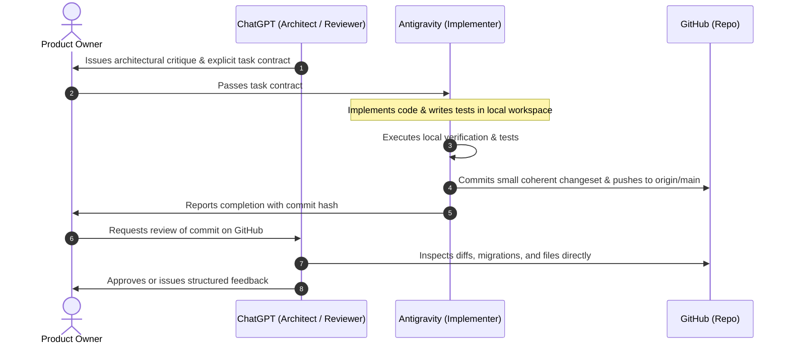

# Agent Operating Contract (AOC)

This document governs the multi-agent collaboration model for the **South African Government Intelligence & Civic Platform**.

---

## 1. Separation of Concerns & Roles

| Entity | Role | Responsibilities | Permissions |
| :--- | :--- | :--- | :--- |
| **User (You)** | **Product Owner & Decision Maker** | Sets priorities, goals, boundaries, and gives final sign-off. | Full Authority |
| **ChatGPT** | **Architect, Reviewer, & Analyst** | Researches legal/civic domains, critiques schema designs, specifies entity contracts, and inspects committed code. | GitHub Read (`pull: true`) |
| **Antigravity** | **Implementation & Engineering Agent** | Writes code in `c:\Projects\South_Africa`, writes database migrations, creates automated tests, runs verification commands, and commits/pushes to GitHub. | Workspace + Git Push |
| **GitHub** | **Shared State of Truth** | Central synchronized source for repository files, specifications, migrations, documentation, and tests. | Canonical VCS |

---

## 2. The Development & Review Loop

---

## 3. Engineering Invariants & Guardrails

1. **Evidence-First Invariant**:
   - **No bare scrapers**: Never do `scraper -> database -> AI`.
   - Every scraped payload, document, or gazette notice must first land in `evidence_records` with an immutable SHA-256 hash, captured timestamp, and source URL before any structured entity (`institutions`, `offices`, `tenders`) or relational edge is substantiated.
2. **Entity-Office Decoupling**:
   - People never belong directly to an `institution`. People hold `offices` via `person_appointments`.
   - Wards strictly belong to exactly one local municipality.
3. **Small, Coherent Commits**:
   - Every commit must represent a single, reviewable unit of work (e.g. `docs: ...`, `schema: ...`, `test: ...`).
   - Every change must pass verification before being committed.
4. **Read/Write Boundary**:
   - ChatGPT reviews committed code remotely via GitHub.
   - Antigravity makes local file and shell operations.
