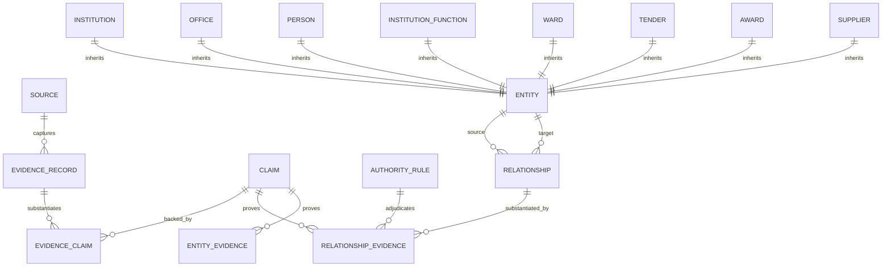

# South African Government Intelligence Platform: Canonical Data Model & Architecture (v0.4)

## 1. Core Vision & Design Tenet
> **"Evidence-backed reasoning with auditable provenance and fail-closed behavior when evidence is insufficient."**

The system enforces a strict four-tier evidentiary lineage:
$$\text{Official Source} \longrightarrow \text{Evidence Record (Snapshot)} \longrightarrow \text{Claims / Assertions} \longrightarrow \text{Canonical Entities & First-Class Relationships (Graph)}$$

---

## 2. Canonical Data Model Schema (PostgreSQL / Supabase)

---

### 2.1 The Evidence & Adjudication Layer
*(Refer to `docs/architecture/evidence_and_provenance_model.md`, `claim_resolution_model.md`, and `canonical_relationship_model.md`)*

* **`sources`**
  * `id`: UUID (PK)
  * `slug`: Text (Unique, e.g., `"za-nat-treasury-etenders"`, `"mp-prov-gazette"`)
  * `name`: Text
  * `source_type`: Enum (`gazette`, `tender_portal`, `municipal_site`, `auditor_general_report`, `national_treasury_api`, `council_minutes`)
  * `base_url`: Text
  * `polling_cadence_minutes`: Integer
  * `is_active`: Boolean

* **`evidence_records`** (Immutable append-only snapshots)
  * `id`: UUID (PK)
  * `source_id`: UUID (FK `sources.id`)
  * `origin_url`: Text
  * `captured_at`: Timestamptz
  * `sha256_payload_hash`: Text (SHA-256 of raw payload)
  * `payload_storage_uri`: Text
  * `mime_type`: Text
  * `byte_size`: Integer
  * `retrieval_metadata`: JSONB
  * `extraction_metadata`: JSONB
  * `raw_extracted_text`: Text

* **`authority_rules`** (Executable legal authority adjudication)
  * `id`: UUID (PK)
  * `claim_predicate`: Text (e.g. `'occupies_office'`, `'issued_tender'`, `'responsible_for_function'`)
  * `source_type`: Enum (`gazette`, `tender_portal`, `municipal_site`, `auditor_general_report`, `national_treasury_api`, `council_minutes`)
  * `authority_rank`: Integer (1 = statutory supreme, 10 = corroborating, 50 = directory listing)
  * `can_substantiate_alone`: Boolean
  * `can_supersede_prior`: Boolean
  * `requires_corroboration`: Boolean
  * `statutory_instrument`: Text (e.g. `"Constitution Schedule 4B"`, `"MFMA S79"`)

* **`claims`**
  * `id`: UUID (PK)
  * `claim_type`: Enum (`entity_existence`, `attribute_assertion`, `relationship_assertion`, `temporal_status`)
  * `subject_raw_text`: Text
  * `subject_canonical_id`: UUID (Nullable, FK `entities.id`)
  * `predicate`: Text
  * `object_raw_text`: Text
  * `object_canonical_id`: UUID (Nullable, FK `entities.id`)
  * `object_value`: JSONB
  * `effective_from`: Date (Nullable)
  * `effective_to`: Date (Nullable)
  * `extraction_confidence`: Float (0.0 - 1.0)
  * `resolution_confidence`: Float (0.0 - 1.0)
  * `processing_stage`: Enum (`extracted`, `normalized`, `resolved`, `validated`, `canonicalized`)
  * `assertion_status`: Enum (`unverified`, `substantiated`, `contested`, `superseded`, `revoked`)
  * `superseded_by_claim_id`: UUID (FK `claims.id`, Nullable)
  * `contested_by_claim_id`: UUID (FK `claims.id`, Nullable)

* **`evidence_claims`**
  * `id`: UUID (PK)
  * `evidence_id`: UUID (FK `evidence_records.id`)
  * `claim_id`: UUID (FK `claims.id`)
  * `excerpt`: Text
  * `locator`: JSONB

---

### 2.2 Canonical Entity Registry & First-Class Relationships

* **`entities`** (Universal node registry providing strict FK targets)
  * `id`: UUID (PK)
  * `entity_type`: Enum (`institution`, `office`, `person`, `function`, `ward`, `tender`, `award`, `supplier`)
  * `canonical_identifier`: Text (Unique compound URN or standard slug)
  * `created_at`: Timestamptz

* **`relationships`** (First-class canonical graph edges)
  * `id`: UUID (PK)
  * `source_entity_id`: UUID (FK `entities.id` ON DELETE RESTRICT)
  * `relationship_predicate`: Enum (
      `oversees_institution`,
      `houses_office`,
      `occupies_office`,
      `responsible_for_function`,
      `contains_ward`,
      `issued_tender`,
      `stipulates_requirement`,
      `awarded_contract`,
      `recipient_supplier`,
      `delegates_procurement_authority`
    )
  * `target_entity_id`: UUID (FK `entities.id` ON DELETE RESTRICT)
  * `relationship_attributes`: JSONB (e.g. `{"acting": true}`, `{"threshold_zar": 200000}`)
  * `effective_from`: Date
  * `effective_to`: Date (Nullable)
  * `observed_at`: Timestamptz
  * `is_active`: Boolean
  * `created_at`: Timestamptz

* **`relationship_evidence`** (Strict, foreign-key enforced edge provenance)
  * `id`: UUID (PK)
  * `relationship_id`: UUID (FK `relationships.id` ON DELETE CASCADE)
  * `claim_id`: UUID (FK `claims.id` ON DELETE RESTRICT)
  * `evidence_record_id`: UUID (FK `evidence_records.id` ON DELETE RESTRICT)
  * `provenance_role`: Enum (`primary_authorizing`, `corroborating`, `superseding`, `contesting`)
  * `verbatim_excerpt`: Text
  * `locator`: JSONB
  * `adjudication_rule_id`: UUID (FK `authority_rules.id`, Nullable)
  * `created_at`: Timestamptz

* **`entity_evidence`** (Entity existence provenance)
  * `id`: UUID (PK)
  * `entity_id`: UUID (FK `entities.id` ON DELETE CASCADE)
  * `claim_id`: UUID (FK `claims.id` ON DELETE RESTRICT)
  * `evidence_record_id`: UUID (FK `evidence_records.id` ON DELETE RESTRICT)

---

### 2.3 Domain Entity Tables (Inheriting `entities.id`)

* **`institutions`**
  * `id`: UUID (PK, FK `entities.id`)
  * `slug`: Text (Unique, e.g. `"mp-mbombela-lm"`)
  * `name`: Text
  * `short_name`: Text
  * `sphere`: Enum (`national`, `provincial`, `local_metro`, `local_district`, `local_local`, `chapter_9`, `soe`)
  * `province`: Enum (Nullable: `EC`, `FS`, `GP`, `KZN`, `LP`, `MP`, `NC`, `NW`, `WC`)
  * `demarcation_code`: Text (e.g. `"MP322"`)
  * `mandate_summary`: Text
  * `contact_details`: JSONB
  * `last_observed_at`: Timestamptz

* **`offices`**
  * `id`: UUID (PK, FK `entities.id`)
  * `title`: Text (e.g., `"Municipal Manager"`, `"Executive Mayor"`, `"Chief Financial Officer"`)
  * `branch`: Enum (`political`, `administrative`, `judicial`, `statutory_oversight`)

* **`people`**
  * `id`: UUID (PK, FK `entities.id`)
  * `full_name`: Text
  * `public_profile_url`: Text

* **`institution_functions`**
  * `id`: UUID (PK, FK `entities.id`)
  * `category`: Text (e.g., `"Potable Water Supply"`, `"Local Road Maintenance"`)
  * `constitutional_schedule`: Enum (`schedule_4a`, `schedule_4b`, `schedule_5a`, `schedule_5b`, `national_exclusive`)
  * `escalation_level`: Integer

* **`wards`**
  * `id`: UUID (PK, FK `entities.id`)
  * `demarcation_code`: Text (e.g., `"MP322_W14"`)
  * `ward_number`: Integer
  * `boundaries_geojson`: JSONB

* **`tenders`**
  * `id`: UUID (PK, FK `entities.id`)
  * `native_bid_number`: Text
  * `canonical_urn`: Text (Unique compound URN)
  * `title`: Text
  * `description`: Text
  * `tender_type`: Enum (`rfq`, `rfp`, `eoi`, `formal_tender`, `emergency_procurement`)
  * `category`: Text
  * `cidb_grading`: Text (Nullable)
  * `estimated_value_zar`: Numeric(15, 2) (Nullable)
  * `publish_date`: Timestamptz
  * `closing_date`: Timestamptz
  * `current_status`: Enum (`open`, `under_evaluation`, `awarded`, `cancelled`, `expired`)
  * `last_observed_at`: Timestamptz

* **`awards`**
  * `id`: UUID (PK, FK `entities.id`)
  * `awarded_amount_zar`: Numeric(15, 2)
  * `award_date`: Date
  * `contract_duration_months`: Integer
  * `bbbee_points_scored`: Numeric(5, 2)
  * `price_points_scored`: Numeric(5, 2)

* **`suppliers`**
  * `id`: UUID (PK, FK `entities.id`)
  * `legal_name`: Text
  * `trading_name`: Text
  * `registration_number`: Text (CIPC)
  * `csd_number`: Text (CSD: `"MAAA..."`)
