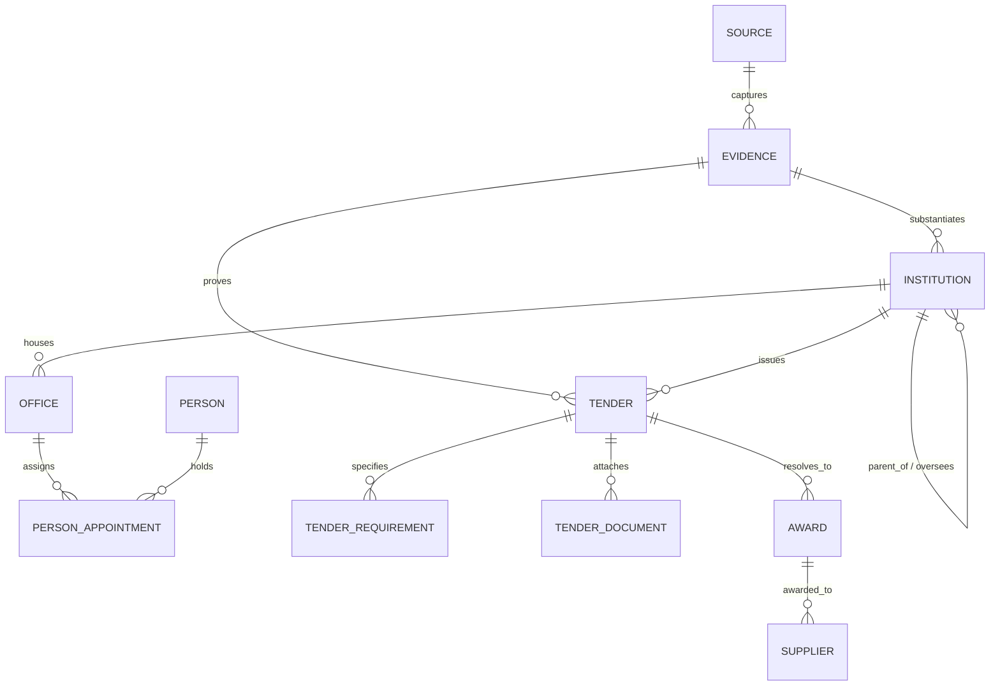

# South African Government Intelligence Platform: Canonical Data Model & Architecture (v0.1)

## 1. Core Vision & Design Tenet
**"Never let AI be the source of truth without an audit trail."**
The system is built on an **Evidence Architecture**:
$$\text{Official Source} \longrightarrow \text{Document / Snapshot} \longrightarrow \text{Evidence Capture} \longrightarrow \text{Structured Entity / Edge} \longrightarrow \text{Reasoning Engine / UI}$$

---

## 2. Canonical Data Model Schema (PostgreSQL / Supabase)

### 2.1 The Evidence & Source Layer
Every entity, relationship, and procurement metric traces back to an immutable snapshot of government records.

* **`sources`**
  * `id`: UUID (PK)
  * `name`: Text (e.g., `"eTenders Portal"`, `"Mpumalanga Provincial Gazette"`, `"City of Mbombela Official Site"`)
  * `source_type`: Enum (`gazette`, `tender_portal`, `municipal_by-law`, `api`, `annual_report`, `treasury_db`)
  * `base_url`: Text
  * `scraper_identifier`: Text
  * `reliability_score`: Float
  * `created_at`: Timestamptz

* **`evidence_records`**
  * `id`: UUID (PK)
  * `source_id`: UUID (FK `sources.id`)
  * `origin_url`: Text
  * `captured_at`: Timestamptz
  * `content_hash`: Text (SHA-256 hash of raw payload or document)
  * `storage_path`: Text (S3 / Supabase Storage bucket path)
  * `mime_type`: Text (`application/pdf`, `text/html`, `application/json`)
  * `raw_text`: Text (Extracted OCR / plain text)
  * `metadata`: JSONB (HTTP headers, scraping run ID, pagination data)

---

### 2.2 The Institutional & Civic Graph (Government Atlas)
Represents the constitutional, national, provincial, municipal, and ward spheres.

* **`institutions`**
  * `id`: UUID (PK)
  * `slug`: Text (Unique, e.g., `"gov-za"`, `"mp-prov"`, `"mp-mbombela-lm"`)
  * `name`: Text (e.g., `"City of Mbombela Local Municipality"`)
  * `short_name`: Text (e.g., `"Mbombela LM"`)
  * `sphere`: Enum (`national`, `provincial`, `local_metro`, `local_district`, `local_local`, `chapter_9`, `soe`)
  * `parent_institution_id`: UUID (FK `institutions.id`, Nullable)
  * `province`: Enum (Nullable for national: `EC`, `FS`, `GP`, `KZN`, `LP`, `MP`, `NC`, `NW`, `WC`)
  * `demarcation_code`: Text (e.g., `"MP322"` for Mbombela)
  * `mandate_summary`: Text (Constitutional/legislative remit)
  * `contact_details`: JSONB (Physical address, switchboard, official email, website)
  * `evidence_id`: UUID (FK `evidence_records.id`)

* **`institutional_functions`**
  * `id`: UUID (PK)
  * `institution_id`: UUID (FK `institutions.id`)
  * `category`: Text (e.g., `"Pothole Maintenance"`, `"Primary Health Care"`, `"Water & Sanitation"`, `"Traffic Licensing"`)
  * `schedule_reference`: Text (e.g., `"Constitution Schedule 4B"`, `"Constitution Schedule 5B"`)
  * `is_primary_authority`: Boolean
  * `escalation_path`: JSONB (Ordered sequence of institution IDs if unresolved)
  * `evidence_id`: UUID (FK `evidence_records.id`)

* **`offices`** (Position/Seat, distinct from the person occupying it)
  * `id`: UUID (PK)
  * `institution_id`: UUID (FK `institutions.id`)
  * `title`: Text (e.g., `"Municipal Manager"`, `"Executive Mayor"`, `"CFO / Head of SCM"`, `"Ward Councillor"`)
  * `is_political`: Boolean (e.g., Mayor vs Accounting Officer/Municipal Manager)
  * `reports_to_office_id`: UUID (FK `offices.id`, Nullable)
  * `procurement_authority_level`: Text (e.g., `"Accounting Officer (unlimited)"`, `"BAC Chair"`, `"Delegated up to R200k"`)

* **`people`**
  * `id`: UUID (PK)
  * `full_name`: Text
  * `public_profile_url`: Text
  * `identifiers`: JSONB (Official government directory IDs, declared disclosures)

* **`person_appointments`**
  * `id`: UUID (PK)
  * `office_id`: UUID (FK `offices.id`)
  * `person_id`: UUID (FK `people.id`)
  * `start_date`: Date
  * `end_date`: Date (Nullable if active)
  * `status`: Enum (`active`, `acting`, `vacated`, `suspended`)
  * `evidence_id`: UUID (FK `evidence_records.id`)

* **`wards`**
  * `id`: UUID (PK)
  * `municipality_id`: UUID (FK `institutions.id`)
  * `ward_number`: Integer
  * `boundaries_geojson`: JSONB
  * `current_councillor_appointment_id`: UUID (FK `person_appointments.id`)

---

### 2.3 The Procurement Observatory (Tenders & Awards)

* **`tenders`**
  * `id`: UUID (PK)
  * `institution_id`: UUID (FK `institutions.id`)
  * `bid_number`: Text (Unique per issuing body, e.g., `"EDM/04/2026/01"`)
  * `title`: Text
  * `description`: Text
  * `tender_type`: Enum (`rfq`, `rfp`, `eoi`, `tender`, `emergency_procurement`)
  * `category`: Text (e.g., `"Civil Engineering"`, `"ICT Services"`, `"Medical Supplies"`)
  * `unspc_codes`: Text[] (Industry taxonomy codes)
  * `cidb_grading`: Text (e.g., `"6CE"`, `"4GB"`, Nullable)
  * `estimated_value_zar`: Numeric(15, 2) (Nullable)
  * `publish_date`: Timestamptz
  * `briefing_date`: Timestamptz (Nullable)
  * `is_briefing_compulsory`: Boolean
  * `closing_date`: Timestamptz
  * `status`: Enum (`open`, `under_evaluation`, `awarded`, `cancelled`, `expired`)
  * `evidence_id`: UUID (FK `evidence_records.id`)

* **`tender_requirements`**
  * `id`: UUID (PK)
  * `tender_id`: UUID (FK `tenders.id`)
  * `requirement_type`: Enum (`tax_pin`, `csd_registered`, `bbbee_level`, `cidb`, `local_content_pledge`, `iso_certification`, `pricing_schedule`)
  * `description`: Text
  * `mandatory`: Boolean

* **`tender_documents`**
  * `id`: UUID (PK)
  * `tender_id`: UUID (FK `tenders.id`)
  * `title`: Text
  * `document_type`: Enum (`bid_spec`, `pricing_schedule`, `mgb_form`, `addendum`, `briefing_minutes`)
  * `file_url`: Text
  * `evidence_id`: UUID (FK `evidence_records.id`)

* **`suppliers`**
  * `id`: UUID (PK)
  * `legal_name`: Text
  * `trading_name`: Text
  * `registration_number`: Text (CIPC, e.g., `"2021/123456/07"`)
  * `csd_number`: Text (National Treasury Central Supplier Database, e.g., `"MAAA..."`)
  * `tax_pin`: Text (Encrypted/masked)
  * `bbbee_level`: Integer
  * `verified_by_evidence_id`: UUID (FK `evidence_records.id`)

* **`awards`**
  * `id`: UUID (PK)
  * `tender_id`: UUID (FK `tenders.id`)
  * `supplier_id`: UUID (FK `suppliers.id`)
  * `awarded_amount_zar`: Numeric(15, 2)
  * `award_date`: Date
  * `contract_duration_months`: Integer
  * `bbbee_points_scored`: Numeric(5, 2)
  * `price_points_scored`: Numeric(5, 2)
  * `gazette_or_notice_evidence_id`: UUID (FK `evidence_records.id`)

---

## 3. v0.1 Vertical Slice: Mpumalanga & City of Mbombela

### Seed Institutions:
1. **Mpumalanga Provincial Government** (`mp-prov`)
   * Office of the Premier
   * Provincial Treasury
   * Department of Public Works, Roads and Transport (DPWRT)
   * Department of Health
2. **Ehlanzeni District Municipality** (`DC32`)
3. **City of Mbombela Local Municipality** (`MP322`)
   * Political structure: Executive Mayor, Speaker, Chief Whip
   * Administrative structure: Municipal Manager, CFO, General Managers (Civil Services, Energy, Community Services)
   * Sample Ward: Ward 14 (Mbombela Central)

### Pilot Scraper & Ingestion Targets:
* **eTenders Portal** filtered by Mpumalanga & City of Mbombela
* **City of Mbombela official notices** (tenders, RFQs, leadership directory)
* **National Treasury MFMA section 71 reports** (budget allocations for municipal capital projects)
