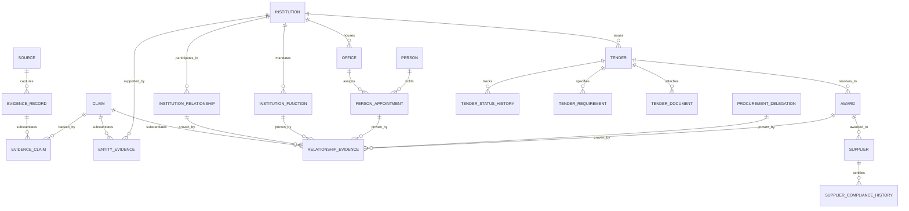

# South African Government Intelligence Platform: Canonical Data Model & Architecture (v0.3)

## 1. Core Vision & Design Tenet
> **"Evidence-backed reasoning with auditable provenance and fail-closed behavior when evidence is insufficient."**

The system enforces a strict four-tier evidentiary lineage:
$$\text{Official Source} \longrightarrow \text{Evidence Record (Snapshot)} \longrightarrow \text{Claims / Assertions} \longrightarrow \text{Entities & Relationships (Graph)}$$

---

## 2. Canonical Data Model Schema (PostgreSQL / Supabase)

---

### 2.1 The Evidence & Claim Layer
*(Refer to `docs/architecture/evidence_and_provenance_model.md` and `docs/architecture/claim_resolution_model.md` for full lifecycle details)*

* **`sources`**
  * `id`: UUID (PK)
  * `slug`: Text (Unique, e.g., `"za-nat-treasury-etenders"`, `"mp-prov-gazette"`)
  * `name`: Text
  * `source_type`: Enum (`gazette`, `tender_portal`, `municipal_site`, `auditor_general_report`, `treasury_api`)
  * `base_url`: Text
  * `polling_cadence_minutes`: Integer
  * `is_active`: Boolean

* **`evidence_records`** (Immutable append-only snapshots)
  * `id`: UUID (PK)
  * `source_id`: UUID (FK `sources.id`)
  * `origin_url`: Text
  * `captured_at`: Timestamptz
  * `sha256_payload_hash`: Text (SHA-256 of raw payload)
  * `payload_storage_uri`: Text (Object store URI)
  * `mime_type`: Text
  * `byte_size`: Integer
  * `retrieval_metadata`: JSONB (HTTP status, headers, worker ID)
  * `extraction_metadata`: JSONB (Parser version, OCR engine, confidence score)
  * `raw_extracted_text`: Text

* **`claims`** (Structured facts decoupling raw extraction from canonical graph)
  * `id`: UUID (PK)
  * `claim_type`: Enum (`entity_existence`, `attribute_assertion`, `relationship_assertion`, `temporal_status`)
  * `subject_raw_text`: Text (Raw extracted subject string)
  * `subject_canonical_id`: UUID (Nullable, populated upon entity resolution)
  * `predicate`: Text (e.g. `holds_office`, `issued_bid`, `responsible_for_function`)
  * `object_raw_text`: Text (Raw extracted object string)
  * `object_canonical_id`: UUID (Nullable, populated upon entity resolution)
  * `object_value`: JSONB (Structured values: e.g. dates, amounts, gradings)
  * `effective_from`: Date (Nullable)
  * `effective_to`: Date (Nullable)
  * `extraction_confidence`: Float (0.0 - 1.0, quality of OCR/parsing)
  * `resolution_confidence`: Float (0.0 - 1.0, certainty of entity matching)
  * `evidentiary_weight`: Enum (`primary_legal_authority`, `official_corroborating`, `supporting_only`)
  * `status`: Enum (`extracted`, `normalized`, `resolved`, `validated`, `contested`, `superseded`, `revoked`)
  * `superseded_by_claim_id`: UUID (FK `claims.id`, Nullable)
  * `contested_by_claim_id`: UUID (FK `claims.id`, Nullable)

* **`evidence_claims`** (Many-to-Many bridge)
  * `id`: UUID (PK)
  * `evidence_id`: UUID (FK `evidence_records.id`)
  * `claim_id`: UUID (FK `claims.id`)
  * `excerpt`: Text (Verbatim snippet proving assertion)
  * `locator`: JSONB (`{"page": 14, "section": "4.2", "coords": [...]}`)

* **`entity_evidence`** (Associative entity provenance)
  * `id`: UUID (PK)
  * `entity_table`: Text (e.g., `'institutions'`, `'people'`, `'suppliers'`)
  * `entity_id`: UUID
  * `claim_id`: UUID (FK `claims.id`)
  * `evidence_record_id`: UUID (FK `evidence_records.id`)

* **`relationship_evidence`** (Associative edge provenance)
  * `id`: UUID (PK)
  * `relationship_table`: Text (e.g., `'person_appointments'`, `'institution_functions'`, `'institution_relationships'`, `'procurement_delegations'`, `'awards'`)
  * `relationship_id`: UUID
  * `claim_id`: UUID (FK `claims.id`)
  * `evidence_record_id`: UUID (FK `evidence_records.id`)
  * `provenance_role`: Enum (`primary_authorizing`, `corroborating`, `superseding`)
  * `excerpt`: Text
  * `locator`: JSONB

---

### 2.2 The Institutional & Civic Graph (Government Atlas)

* **`institutions`**
  * `id`: UUID (PK)
  * `slug`: Text (Unique, e.g., `"za-gov"`, `"mp-prov"`, `"mp-mbombela-lm"`)
  * `name`: Text (e.g., `"City of Mbombela Local Municipality"`)
  * `short_name`: Text
  * `sphere`: Enum (`national`, `provincial`, `local_metro`, `local_district`, `local_local`, `chapter_9`, `soe`)
  * `province`: Enum (Nullable: `EC`, `FS`, `GP`, `KZN`, `LP`, `MP`, `NC`, `NW`, `WC`)
  * `demarcation_code`: Text (e.g., `"MP322"`)
  * `mandate_summary`: Text
  * `contact_details`: JSONB
  * `last_observed_at`: Timestamptz

* **`institution_relationships`** (Relational edges)
  * `id`: UUID (PK)
  * `parent_institution_id`: UUID (FK `institutions.id`)
  * `child_institution_id`: UUID (FK `institutions.id`)
  * `relationship_type`: Enum (`oversight`, `legislative_authority`, `executive_reporting`, `provincial_supervision`, `district_coordination`)
  * `effective_from`: Date
  * `effective_to`: Date (Nullable)

* **`institution_functions`** (Relational competency and escalation)
  * `id`: UUID (PK)
  * `institution_id`: UUID (FK `institutions.id`)
  * `category`: Text (e.g., `"Potable Water Supply"`, `"Local Road Maintenance"`, `"Provincial Roads"`)
  * `constitutional_schedule`: Enum (`schedule_4a`, `schedule_4b`, `schedule_5a`, `schedule_5b`, `national_exclusive`)
  * `is_primary_authority`: Boolean
  * `escalation_institution_id`: UUID (FK `institutions.id`, Nullable)
  * `escalation_level`: Integer (1 = Local LM, 2 = District DM, 3 = Prov Dept, 4 = National / AG)

* **`offices`**
  * `id`: UUID (PK)
  * `institution_id`: UUID (FK `institutions.id`)
  * `title`: Text (e.g., `"Municipal Manager"`, `"Executive Mayor"`, `"Chief Financial Officer"`)
  * `branch`: Enum (`political`, `administrative`, `judicial`, `statutory_oversight`)
  * `reports_to_office_id`: UUID (FK `offices.id`, Nullable)

* **`procurement_delegations`**
  * `id`: UUID (PK)
  * `office_id`: UUID (FK `offices.id`)
  * `delegation_instrument`: Text (e.g., `"Council Resolution 2024/09"`, `"MFMA S79 Delegation Register"`)
  * `threshold_zar`: Numeric(15, 2) (Nullable if unlimited)
  * `effective_from`: Date
  * `effective_to`: Date (Nullable)

* **`people`**
  * `id`: UUID (PK)
  * `full_name`: Text
  * `public_profile_url`: Text

* **`person_appointments`**
  * `id`: UUID (PK)
  * `office_id`: UUID (FK `offices.id`)
  * `person_id`: UUID (FK `people.id`)
  * `start_date`: Date
  * `end_date`: Date (Nullable)
  * `status`: Enum (`active`, `acting`, `vacated`, `suspended`)

* **`demarcation_cycles`**
  * `id`: UUID (PK)
  * `code`: Text (e.g., `"MDB_2021_2026"`)
  * `effective_from`: Date
  * `effective_to`: Date

* **`wards`**
  * `id`: UUID (PK)
  * `municipality_id`: UUID (FK `institutions.id`)
  * `demarcation_cycle_id`: UUID (FK `demarcation_cycles.id`)
  * `ward_number`: Integer
  * `boundaries_geojson`: JSONB

---

### 2.3 The Procurement Observatory (Tenders & Awards)

* **`tenders`**
  * `id`: UUID (PK)
  * `issuing_institution_id`: UUID (FK `institutions.id`)
  * `native_bid_number`: Text
  * `canonical_urn`: Text (Unique: e.g. `urn:za:procurement:mp322:edm-04-2026-01`)
  * `title`: Text
  * `description`: Text
  * `tender_type`: Enum (`rfq`, `rfp`, `eoi`, `formal_tender`, `emergency_procurement`)
  * `category`: Text
  * `cidb_grading`: Text (Nullable)
  * `estimated_value_zar`: Numeric(15, 2) (Nullable)
  * `publish_date`: Timestamptz
  * `briefing_date`: Timestamptz (Nullable)
  * `is_briefing_compulsory`: Boolean
  * `closing_date`: Timestamptz
  * `current_status`: Enum (`open`, `under_evaluation`, `awarded`, `cancelled`, `expired`)
  * `last_observed_at`: Timestamptz

* **`tender_status_history`**
  * `id`: UUID (PK)
  * `tender_id`: UUID (FK `tenders.id`)
  * `status`: Enum (`open`, `under_evaluation`, `awarded`, `cancelled`, `expired`)
  * `observed_at`: Timestamptz
  * `evidence_record_id`: UUID (FK `evidence_records.id`)

* **`tender_requirements`**
  * `id`: UUID (PK)
  * `tender_id`: UUID (FK `tenders.id`)
  * `requirement_type`: Enum (`tax_pin`, `csd_registration`, `bbbee_level`, `cidb`, `local_content`, `iso_cert`, `pricing_schedule`)
  * `description`: Text
  * `mandatory`: Boolean

* **`tender_documents`**
  * `id`: UUID (PK)
  * `tender_id`: UUID (FK `tenders.id`)
  * `title`: Text
  * `document_type`: Enum (`bid_specification`, `pricing_schedule`, `mgb_declaration`, `addendum`, `briefing_minutes`)
  * `file_uri`: Text
  * `evidence_record_id`: UUID (FK `evidence_records.id`)

* **`suppliers`**
  * `id`: UUID (PK)
  * `legal_name`: Text
  * `trading_name`: Text
  * `registration_number`: Text (CIPC, e.g., `"2021/123456/07"`)
  * `csd_number`: Text (CSD: `"MAAA..."`)

* **`supplier_compliance_history`**
  * `id`: UUID (PK)
  * `supplier_id`: UUID (FK `suppliers.id`)
  * `bbbee_level`: Integer
  * `tax_compliance_status`: Enum (`compliant`, `non_compliant`, `expired`)
  * `cidb_gradings`: Text[]
  * `valid_from`: Date
  * `valid_to`: Date
  * `evidence_record_id`: UUID (FK `evidence_records.id`)

* **`awards`**
  * `id`: UUID (PK)
  * `tender_id`: UUID (FK `tenders.id`)
  * `supplier_id`: UUID (FK `suppliers.id`)
  * `awarded_amount_zar`: Numeric(15, 2)
  * `award_date`: Date
  * `contract_duration_months`: Integer
  * `bbbee_points_scored`: Numeric(5, 2)
  * `price_points_scored`: Numeric(5, 2)
