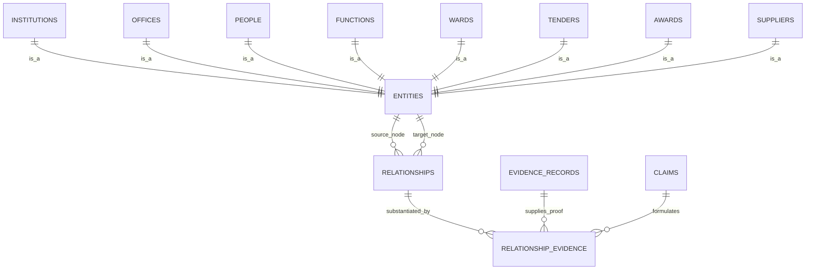

# Canonical Relationship & Authority Adjudication Model (v0.4.1)

This document establishes the definitive specification for **First-Class Relationships, Strict Referential Integrity, Multi-Dimensional Claim Lifecycle, Relationship Deduplication, and Contextual Authority Adjudication** for the South African Government Intelligence & Civic Platform.

---

## 1. First-Class Canonical Relationships: Solving the Polymorphic FK Problem

### 1.1 The Polymorphic Anti-Pattern vs Canonical Graph Edges
To eliminate `relationship_table + relationship_id` (which PostgreSQL cannot enforce with foreign keys), the platform introduces a **first-class `relationships` table** as the universal substrate for all directed edges between canonical entities.

Every canonical node (institution, office, person, ward, function, tender, award, supplier) inherits a globally unique canonical entity UUID registered in a lightweight registry `entities`:



### 1.2 The Relational Edge Schema (`relationships`)
* `id`: UUID (PK)
* `source_entity_id`: UUID (FK `entities.id` ON DELETE RESTRICT)
* `relationship_predicate`: Enum
  * `oversees_institution` (e.g. Provincial Dept $\to$ Municipality)
  * `houses_office` (e.g. Municipality $\to$ Office)
  * `occupies_office` (e.g. Person $\to$ Office)
  * `responsible_for_function` (e.g. Municipality $\to$ Function)
  * `contains_ward` (e.g. Municipality $\to$ Ward)
  * `issued_tender` (e.g. Municipality $\to$ Tender)
  * `stipulates_requirement` (e.g. Tender $\to$ Requirement)
  * `awarded_contract` (e.g. Tender $\to$ Award)
  * `recipient_supplier` (e.g. Award $\to$ Supplier)
  * `delegates_procurement_authority` (e.g. Office $\to$ Office)
* `target_entity_id`: UUID (FK `entities.id` ON DELETE RESTRICT)
* `relationship_attributes`: JSONB (Specific typed metadata, e.g. `{"delegation_threshold_zar": 200000}`, `{"appointment_nature": "acting"}`)
* `effective_from`: Date (Stated legal commencement)
* `effective_to`: Date (Nullable: active until terminated/superseded)
* `observed_at`: Timestamptz (When verified by ingestion)
* `created_at`: Timestamptz

> **Note on `is_active`**:
> Canonical truth is **computed** rather than trusting a manually toggled boolean:
> An edge is active if and only if `effective_from <= CURRENT_DATE` AND (`effective_to IS NULL` OR `effective_to >= CURRENT_DATE`) AND it is backed by at least one `substantiated` claim.

### 1.3 Relationship Identity & Deduplication Policy
To prevent duplicate identical canonical edges during continuous ingestion:
1. **Deduplication Key**: A canonical relationship's primary identity is defined by the compound tuple:
   $$\text{Identity} = (\text{source\_entity\_id}, \text{relationship\_predicate}, \text{target\_entity\_id}, \text{effective\_from})$$
2. **Ingestion Resolution Protocol**:
   * When an extracted claim resolves to $(S, P, T, D_{\text{start}})$:
   * If an edge with $(S, P, T, D_{\text{start}})$ exists:
     * Ingestion **links new evidence** to the existing edge via `relationship_evidence` rather than creating a duplicate row.
     * If new evidence refines `effective_to` or attributes, an update is applied via an audited claim.
   * If no edge exists:
     * A new `relationships` row is instantiated upon claim validation.

### 1.4 Strict Relationship Provenance (`relationship_evidence`)
Because `relationships` is a single canonical table, `relationship_evidence` uses direct, foreign-key enforced referential integrity:

* `id`: UUID (PK)
* `relationship_id`: UUID (FK `relationships.id` ON DELETE CASCADE)
* `claim_id`: UUID (FK `claims.id` ON DELETE RESTRICT)
* `evidence_record_id`: UUID (FK `evidence_records.id` ON DELETE RESTRICT)
* `provenance_role`: Enum (`primary_authorizing`, `corroborating`, `superseding`, `contesting`)
* `verbatim_excerpt`: Text (Exact quotation from the document supporting this edge)
* `locator`: JSONB (`{"page": 12, "section": "3.1", "clause": "Appointment Resolution"}`)
* `adjudication_rule_id`: UUID (FK `authority_rules.id`, Nullable)
* `created_at`: Timestamptz

---

## 2. Decoupled Claim Lifecycle: Stage vs Epistemic Status

To eliminate conflation between *where a claim is in processing* and *what the platform believes about it*, we formalize two orthogonal state vectors:

```text
┌────────────────────────────────────────────────────────────────────────────────────────┐
│ Vector A: Processing Pipeline Stage (processing_stage)                                 │
├─────────────────┬──────────────────────────────────────────────────────────────────────┤
│ 1. extracted    │ Raw strings captured from OCR/parsers; entities unresolved.          │
│ 2. normalized   │ Strings cleansed (case, CIPC codes, whitespace, date standardization)│
│ 3. resolved     │ Candidate entities linked to canonical entity registry IDs.          │
│ 4. validated    │ Evaluated against machine-readable Authority Matrix rules.           │
│ 5. canonicalized│ Instantiated as an active node or edge in the canonical graph.       │
└─────────────────┴──────────────────────────────────────────────────────────────────────┘

┌────────────────────────────────────────────────────────────────────────────────────────┐
│ Vector B: Epistemic / Assertion Status (assertion_status)                             │
├─────────────────┬──────────────────────────────────────────────────────────────────────┤
│ 1. unverified   │ Freshly extracted; awaiting corroboration or authority evaluation.    │
│ 2. substantiated│ Backed by primary statutory or corroborating legal evidence.         │
│ 3. contested    │ Disputed by a competing assertion of comparable/conflicting weight.  │
│ 4. superseded   │ Historically valid, but replaced by a newer authoritative legal act. │
│ 5. revoked      │ Formally annulled, rescinded, or declared irregular.                  │
└─────────────────┴──────────────────────────────────────────────────────────────────────┘
```

> **Strict Invariant**: There is no pseudo-status like `contested_subordinate`. A contested assertion has `assertion_status = 'contested'`. Adjudication subordination is handled by the relative `authority_rank` within that rule evaluation, leaving the higher-ranked claim as `substantiated` and the lower-ranked as `contested`.

---

## 3. Contextual Authority Adjudication Engine

### 3.1 Clarification: `authority_rank` is an Ordering, Not a Truth Score
`authority_rank` is **strictly an adjudication sorting integer within a specific `(claim_predicate, source_type)` rule context**, not a universal measure of absolute truth.
* For `occupies_office`: Provincial Gazette has `authority_rank = 1`; Municipal Website has `authority_rank = 10`.
* For `stipulates_tender_deadline`: Official Tender Addendum has `authority_rank = 1`; Original Bid PDF has `authority_rank = 2`; Gazette is not applicable.

### 3.2 Authority Rules Table (`authority_rules`)
* `id`: UUID (PK)
* `claim_predicate`: Text (e.g. `'occupies_office'`, `'issued_tender'`, `'awarded_contract'`, `'responsible_for_function'`)
* `source_type`: Enum (`gazette`, `tender_portal`, `municipal_site`, `auditor_general_report`, `national_treasury_api`, `council_minutes`)
* `authority_rank`: Integer (Lower integer = higher precedence within this predicate scope)
* `can_substantiate_alone`: Boolean (If true, a single evidence record can mark claim `substantiated`)
* `can_supersede_prior`: Boolean (If true, can transition prior claims to `superseded`)
* `requires_corroboration`: Boolean (If true, cannot substantiate without a second distinct source)
* `statutory_instrument`: Text (e.g. `"Constitution Act 108 of 1996"`, `"MFMA S79"`, `"Public Finance Management Act"`)

### 3.3 Conflict Resolution Protocol
When a claim asserts edge $E_1 = (S, P, T)$ that conflicts with existing assertion $E_2 = (S, P, T')$:
1. Both claims remain in `claims` (zero loss of historical evidence).
2. Query `authority_rules` for predicate $P$ across the source types of $E_1$ and $E_2$.
3. If one rule has a strictly lower `authority_rank` (higher precedence):
   * Higher-precedence claim becomes `substantiated` (canonical edge active).
   * Lower-precedence claim becomes `contested` (flagged, inactive, with `contested_by_claim_id` pointing to the superior claim).
4. If ranks are identical: Both become `contested` until manual administrative review.
