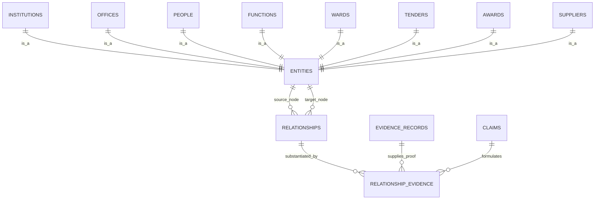

# Canonical Relationship & Authority Adjudication Model

This document establishes the definitive specification for **First-Class Relationships, Strict Referential Integrity, Multi-Dimensional Claim Lifecycle, and Machine-Readable Authority Adjudication** for the South African Government Intelligence & Civic Platform.

---

## 1. First-Class Canonical Relationships: Solving the Polymorphic FK Problem

### 1.1 The Polymorphic Anti-Pattern vs Canonical Graph Edges
To eliminate `relationship_table + relationship_id` (which PostgreSQL cannot enforce with foreign keys), the platform introduces a **first-class `relationships` table** as the universal substrate for all directed edges between canonical entities.

Every canonical node (institution, office, person, ward, function, tender, award, supplier) inherits a globally unique canonical entity UUID registered in a lightweight registry `entities`:



### 1.2 The Relational Edge Schema (`relationships`)
* `id`: UUID (PK)
* `source_entity_id`: UUID (FK `entities.id` ON DELETE RESTRICT)
* `relationship_predicate`: Enum
  * `oversees_institution` (e.g. Provincial Dept $\to$ Municipality)
  * `houses_office` (e.g. Municipality $\to$ Office)
  * `occupies_office` (e.g. Person $\to$ Office)
  * `responsible_for_function` (e.g. Municipality $\to$ Function)
  * `contains_ward` (e.g. Municipality $\to$ Ward)
  * `issued_tender` (e.g. Municipality $\to$ Tender)
  * `stipulates_requirement` (e.g. Tender $\to$ Requirement)
  * `awarded_contract` (e.g. Tender $\to$ Award)
  * `recipient_supplier` (e.g. Award $\to$ Supplier)
  * `delegates_procurement_authority` (e.g. Office $\to$ Office)
* `target_entity_id`: UUID (FK `entities.id` ON DELETE RESTRICT)
* `relationship_attributes`: JSONB (Specific typed metadata, e.g. `{"delegation_threshold_zar": 200000}`, `{"appointment_nature": "acting"}`)
* `effective_from`: Date (Stated legal commencement)
* `effective_to`: Date (Nullable: active until terminated/superseded)
* `observed_at`: Timestamptz (When verified by ingestion)
* `is_active`: Boolean (Computed or managed active flag)
* `created_at`: Timestamptz

### 1.3 Strict Relationship Provenance (`relationship_evidence`)
Because `relationships` is a single canonical table, `relationship_evidence` uses direct, foreign-key enforced referential integrity:

* `id`: UUID (PK)
* `relationship_id`: UUID (FK `relationships.id` ON DELETE CASCADE)
* `claim_id`: UUID (FK `claims.id` ON DELETE RESTRICT)
* `evidence_record_id`: UUID (FK `evidence_records.id` ON DELETE RESTRICT)
* `provenance_role`: Enum (`primary_authorizing`, `corroborating`, `superseding`, `contesting`)
* `verbatim_excerpt`: Text (Exact quotation from the document supporting this edge)
* `locator`: JSONB (`{"page": 12, "section": "3.1", "clause": "Appointment Resolution"}`)
* `adjudication_rule_id`: UUID (FK `authority_rules.id`, Nullable)
* `created_at`: Timestamptz

---

## 2. Decoupled Claim Lifecycle: Stage vs Epistemic Status

To eliminate conflation between *where a claim is in processing* and *what the platform believes about it*, we formalize two orthogonal state vectors:

```text
┌────────────────────────────────────────────────────────────────────────────────────────┐
│ Vector A: Processing Pipeline Stage (processing_stage)                                 │
├─────────────────┬──────────────────────────────────────────────────────────────────────┤
│ 1. extracted    │ Raw strings captured from OCR/parsers; entities unresolved.          │
│ 2. normalized   │ Strings cleansed (case, CIPC codes, whitespace, date standardization)│
│ 3. resolved     │ Candidate entities linked to canonical entity registry IDs.          │
│ 4. validated    │ Evaluated against machine-readable Authority Matrix rules.           │
│ 5. canonicalized│ Instantiated as an active node or edge in the canonical graph.       │
└─────────────────┴──────────────────────────────────────────────────────────────────────┘

┌────────────────────────────────────────────────────────────────────────────────────────┐
│ Vector B: Epistemic / Assertion Status (assertion_status)                             │
├─────────────────┬──────────────────────────────────────────────────────────────────────┤
│ 1. unverified   │ Freshly extracted; awaiting corroboration or authority evaluation.    │
│ 2. substantiated│ Backed by primary statutory or corroborating legal evidence.         │
│ 3. contested    │ Disputed by a competing assertion of comparable/conflicting weight.  │
│ 4. superseded   │ Historically valid, but replaced by a newer authoritative legal act. │
│ 5. revoked      │ Formally annulled, rescinded, or declared irregular.                  │
└─────────────────┴──────────────────────────────────────────────────────────────────────┘
```

### Allowed State Transitions
* `extracted` $\to$ `normalized` $\to$ `resolved` $\to$ `validated` $\to$ `canonicalized` (Pipeline progression).
* `unverified` $\to$ `substantiated` upon passing `authority_rules`.
* `substantiated` $\to$ `contested` upon ingestion of a contradictory assertion before adjudication.
* `substantiated` $\to$ `superseded` upon receipt of a newer authoritative claim with `effective_from > previous.effective_from`.
* `substantiated` $\to$ `revoked` if an Auditor-General or High Court review sets aside the appointment or award.

---

## 3. Machine-Readable Authority Adjudication Engine

Rather than relying on static Markdown tables or arbitrary decimal probabilities, authority is encoded into executable rules in the database.

### 3.1 Authority Rules Table (`authority_rules`)
* `id`: UUID (PK)
* `claim_predicate`: Text (e.g. `'occupies_office'`, `'issued_tender'`, `'awarded_contract'`, `'responsible_for_function'`)
* `source_type`: Enum (`gazette`, `tender_portal`, `municipal_site`, `auditor_general_report`, `national_treasury_api`, `council_minutes`)
* `publisher_authority_tier`: Enum (`statutory_gazette`, `statutory_portal`, `official_institutional_site`, `reputable_third_party`)
* `authority_rank`: Integer (1 = supreme legal authority, 10 = corroborating, 50 = weak supporting)
* `can_substantiate_alone`: Boolean (If true, a single evidence record can mark claim `substantiated`)
* `can_supersede_prior`: Boolean (If true, can transition prior claims to `superseded`)
* `requires_corroboration`: Boolean (If true, cannot substantiate without a second distinct source)
* `statutory_instrument`: Text (e.g. `"Constitution Act 108 of 1996"`, `"MFMA S79"`, `"Public Finance Management Act"`)

### 3.2 Machine Evaluation Protocol
When a claim asserts an edge $E = (S, P, T)$:
1. Query `authority_rules` matching predicate $P$ and the evidence's `source_type`.
2. If competing claim $C_2$ exists for $(S, P)$ within overlapping `[effective_from, effective_to]`:
   * Compare `authority_rank` of $C_1$ vs $C_2$.
   * If ranks are unequal: Higher rank becomes `substantiated` (canonical edge active), lower rank becomes `contested_subordinate`.
   * If ranks are equal: Both become `contested` (flagged for review; no edge canonicalized without manual sign-off).
3. Record the exact rule used in `relationship_evidence.adjudication_rule_id`.

---

## 4. Non-Destructive Temporal Traceability & Provenance Walk

### Concrete Scenario: CFO of Municipality MP322
* **2024-01-01**: Municipal Gazette 100 appoints **Person W** as CFO.
  * Canonical Edge: `(Person W) -[occupies_office]-> (Office: CFO)` (`effective_from: 2024-01-01`, `effective_to: 2026-07-31`).
* **2026-08-01**: Provincial Gazette 3412 appoints **Person X** as Acting CFO.
  * Canonical Edge 1 updated: `effective_to = 2026-07-31`, `assertion_status = 'superseded'`.
  * Canonical Edge 2 created: `(Person X) -[occupies_office]-> (Office: CFO)` (`effective_from: 2026-08-01`, `effective_to: null`, `assertion_status = 'substantiated'`).
* **2026-09-01**: Ingestion captures municipal website still listing **Person W**.
  * Extraction creates Claim: `(Person W) -[occupies_office]-> (Office: CFO)`.
  * Adjudication evaluates: Website (`authority_rank = 50`) vs Gazette (`authority_rank = 1`).
  * Website claim marked `contested_subordinate`, does **not** alter Canonical Edge 2.

### Auditable Query Walk (The "Why" Trace):
$$\text{Query: "Who is the CFO of Mbombela and why?"}$$
$$\Downarrow$$
1. `relationships` $\to$ Active edge: `(Person X) -[occupies_office {acting: true}]-> (CFO Office)`
2. `relationship_evidence` $\to$ Links to `claim_id` and `evidence_record_id` (Provincial Gazette 3412)
3. `authority_rules` $\to$ Rule: *Gazette appointment notice supersedes municipal directory (`rank = 1` vs `rank = 50`)*
4. `evidence_records` $\to$ Returns SHA-256 hash, PDF URI, capture timestamp, and verbatim excerpt:
   > *"Notice is hereby given in terms of Section 56 of the Systems Act that Dr. X is appointed Acting CFO effective 1 August 2026."*
