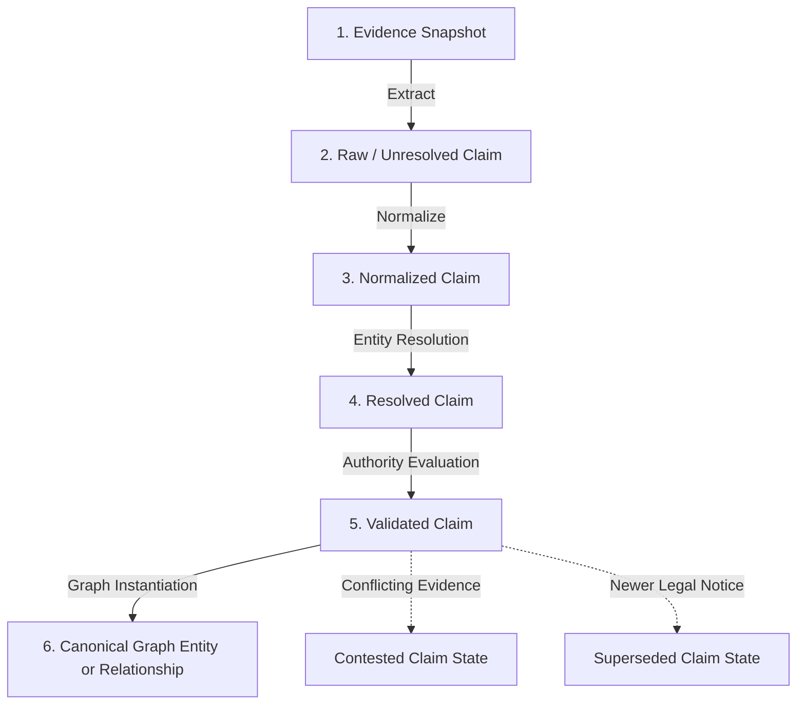
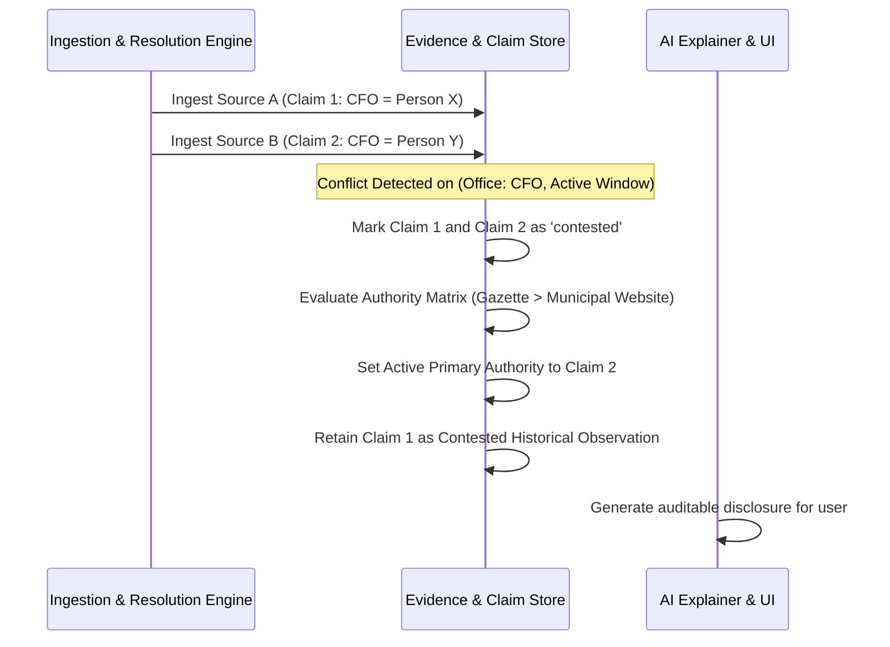

# Claim Resolution & Relationship Provenance Architecture

This document establishes the canonical specification for **Claim Resolution, Entity Resolution, and Relationship Provenance** for the South African Government Intelligence & Civic Platform.

---

## 1. Epistemic Architecture & The 6-Stage Claim Lifecycle

Evidence captured from an official source does not automatically become truth in the canonical graph. An extracted datum must traverse an auditable lifecycle before it can instantiate or mutate an entity or edge:



### Stage 1: Evidence Capture
An immutable binary/HTML snapshot is ingested, SHA-256 hashed, and logged with retrieval HTTP metadata in `evidence_records`.

### Stage 2: Extraction (`claims.status = 'extracted'`)
Raw parsers (OCR, regex, table extractors, NLP) extract subject strings, predicate tokens, and object values.
* **Invariant**: At this stage, `subject_identifier` and `object_identifier` are unlinked text strings (e.g. `"Mbombela Local Municipality"` or `"Dr. N. P. Nkosi"`). Canonical foreign keys are null.

### Stage 3: Normalization (`claims.status = 'normalized'`)
Identifiers are cleansed:
* Demarcation codes are normalized (e.g. `"mp 322"` $\to$ `"MP322"`).
* Company registration numbers are converted to CIPC standard formats (`YYYY/NNNNNN/NN`).
* Bid references are canonicalized to standard case with whitespace trimmed.

### Stage 4: Entity Resolution (`claims.status = 'resolved'`)
The resolution engine matches the normalized string to a canonical entity (`canonical_entity_id`) using deterministic matchers, alias registries, or fuzzy algorithms:
* If match is exact (e.g. unique CSD number `MAAA...` or demarcation code `MP322`), `resolution_confidence = 1.0`.
* If matched via alias table or token distance, resolution confidence is recorded alongside the candidate pool.
* If resolution is ambiguous or below threshold, the claim remains **unresolved** and is routed to human curation.

### Stage 5: Authority Evaluation (`claims.status = 'validated'`)
The claim is evaluated against the source's authority for that **specific claim type** (see Section 3). If evidentiary criteria are met, the claim is marked `substantiated`.

### Stage 6: Canonical Graph Instantiation
The validated claim substantiates an active entity or relationship in the canonical graph, accompanied by an explicit row in `relationship_evidence` or `entity_evidence`.

---

## 2. Confidence Disambiguation: Deconstructing the "Magic Number"

To ensure full transparency and avoid opaque probability metrics, the platform breaks confidence down into three distinct, orthogonal vectors:

```text
┌───────────────────────────┬──────────────────────────────────────────────────────────────────┐
│ Confidence Dimension      │ Definition & Operational Scope                                   │
├───────────────────────────┼──────────────────────────────────────────────────────────────────┤
│ 1. Extraction Confidence  │ "Did the parser/OCR accurately read the physical document?"     │
│    (0.0 - 1.0)            │ Governed by OCR engine bounding-box scores, character-level      │
│                           │ clarity, and JSON parsing integrity.                             │
├───────────────────────────┼──────────────────────────────────────────────────────────────────┤
│ 2. Resolution Confidence  │ "Did we link the extracted string to the correct canonical entity?"│
│    (0.0 - 1.0)            │ Governed by exact identifier matching (CSD, CIPC, Demarcation)    │
│                           │ vs alias dictionary vs fuzzy string similarity distance.        │
├───────────────────────────┼──────────────────────────────────────────────────────────────────┤
│ 3. Evidentiary Weight     │ "How legally authoritative is this source for this claim type?"  │
│    (Enum/Score)           │ Governed by the Claim-Type Authority Matrix (Section 3).         │
└───────────────────────────┴──────────────────────────────────────────────────────────────────┘
```

---

## 3. Claim-Type Specific Source Authority Matrix

Universal source hierarchies (e.g. "Gazette always beats everything") fail because authority is strictly contextual. The platform applies domain-specific legal hierarchies:

| Claim Domain / Type | Primary Authoritative Source | Secondary / Corroborating Source | Non-Authoritative / Supporting Only |
| :--- | :--- | :--- | :--- |
| **Official Leadership & Appointments** | Provincial / National Gazette, Formal Council Minutes | Departmental Media Statements | Municipal Public Website Directory |
| **Tender Deadlines & Briefing Dates** | Official Tender Addendum, eTenders Bulletin | Original Bid Specification PDF | Unofficial Procurement Aggregators |
| **Audit Findings & Financial Metrics** | Auditor-General (AGSA) Audit Reports | National Treasury S71 Publications | Municipal PR Releases |
| **Constitutional Functional Competency** | Schedules 4 & 5 of the Constitution | Provincial Gazette Notices (Section 12 Notices)| Municipal By-laws |
| **Procurement Delegations & Thresholds** | Municipal Council Delegation Register / Policy | MFMA S79 / S106 Declarations | Departmental Org Charts |
| **Supplier Legal & CSD Status** | CSD (Central Supplier Database) API/Export | CIPC Companies Registry | Tender B-BBEE affidavits |

---

## 4. Explicit Relationship Provenance Architecture

Relationships (edges) are first-class citizens. An edge is not merely a foreign key column; it is a substantiated institutional fact.

### 4.1 Canonical Relationship Provenance Schema
Every relational table in the canonical graph (e.g., `institution_relationships`, `institution_functions`, `person_appointments`, `procurement_delegations`, `tender_awards`) links to evidence via an explicit provenance bridge:

```text
┌─────────────────────────────────────────────────────────────────────────────────────────────────┐
│                                   relationship_evidence                                         │
├─────────────────────────────┬───────────┬───────────────────────────────────────────────────────┤
│ Column                      │ Type      │ Description                                           │
├─────────────────────────────┼───────────┼───────────────────────────────────────────────────────┤
│ id                          │ UUID (PK) │ Unique identifier                                     │
│ relationship_table          │ Text      │ e.g. 'person_appointments', 'institution_functions'   │
│ relationship_id             │ UUID      │ Foreign Key to the specific relationship row          │
│ claim_id                    │ UUID (FK) │ Foreign Key to the resolved claim                     │
│ evidence_record_id          │ UUID (FK) │ Foreign Key to the immutable evidence snapshot        │
│ provenance_role             │ Enum      │ 'primary_authorizing', 'corroborating', 'superseding' │
│ excerpt                     │ Text      │ Verbatim clause, paragraph, or resolution text        │
│ locator                     │ JSONB     │ {"page": 14, "section": "4.2", "coords": [..]}        │
│ observed_at                 │ Timestamp │ When this relationship state was verified             │
└─────────────────────────────┴───────────┴───────────────────────────────────────────────────────┘
```

### 4.2 Concrete Relational Edge Provenance Mapping

1. **`institution -> institution` (`institution_relationships`)**
   * *Edge*: Province oversight over Local Municipality.
   * *Provenance*: Substantiated by Provincial Gazette Section 12 Notice or Constitution Section 139 intervention notice.
2. **`person -> appointment -> office` (`person_appointments`)**
   * *Edge*: Person appointed Acting Municipal Manager.
   * *Provenance*: Substantiated by Municipal Council Resolution extracts or Gazette appointment notice.
3. **`institution -> function` (`institution_functions`)**
   * *Edge*: City of Mbombela responsible for *Potable Water Supply*.
   * *Provenance*: Constitution Schedule 4B + Water Services Act WSA Authorization Gazette.
4. **`tender -> institution` (`tenders`)**
   * *Edge*: Tender issued by Ehlanzeni District Municipality.
   * *Provenance*: Official bid notice published under issuing authority's eTenders CSD account.
5. **`tender -> award -> supplier` (`awards`)**
   * *Edge*: Award of Contract EDM/04/2026/01 to Supplier ABC.
   * *Provenance*: Published award notice in eTender portal / Council SCM Quarterly Report with contract value and scoring points.

---

## 5. Conflict Resolution & Non-Destructive History

When two official sources publish contradictory claims for the same entity or relationship:

$$\text{Source A (Municipal Site)} \implies \text{"Person X is CFO"}$$
$$\text{Source B (Provincial Gazette)} \implies \text{"Person Y was appointed Acting CFO on 2026-08-15"}$$

The platform executes the following deterministic protocol:



1. **Zero Overwrites**: Neither record is updated in place or discarded. Both claims are preserved with their respective evidence IDs and timestamps.
2. **State Tagging**: Both claims receive status `contested`.
3. **Statutory Adjudication**: The engine marks the claim backed by higher domain-specific authority as `primary_asserted`, while linking the subordinate claim in `contested_by_claim_id`.
4. **Transparent Presentation**: The UI and AI Explainer surface the exact contradiction:
   > *"The Municipal Directory (captured 2026-09-01) still lists Person X as CFO. However, Provincial Gazette No. 3412 (captured 2026-08-15) officially gazetted Person Y as Acting CFO. The Gazette is considered legally authoritative."*
