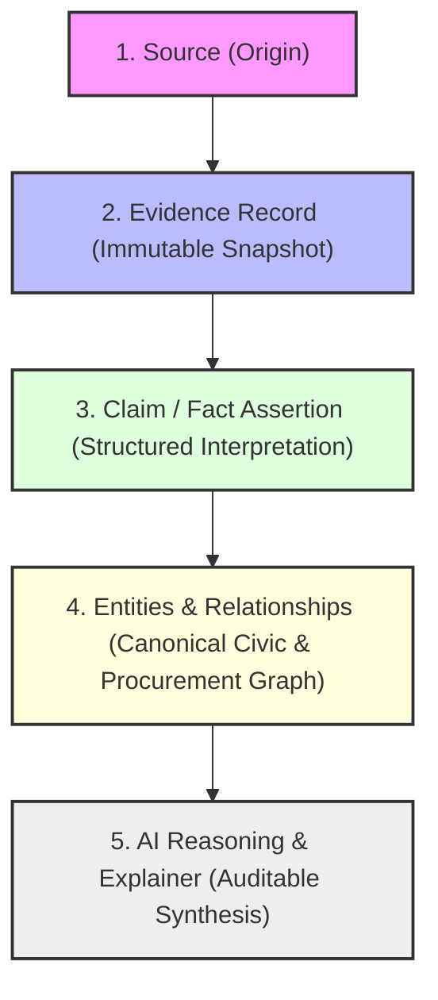
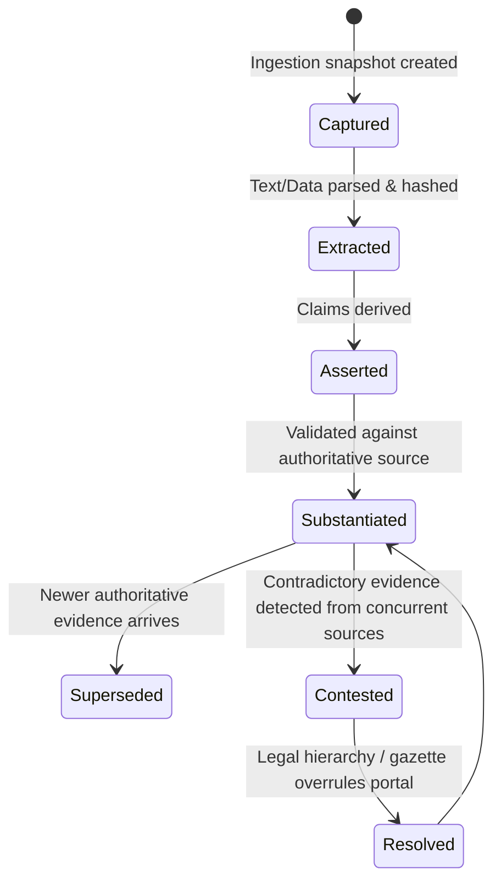

# Evidence & Provenance Model

This document establishes the canonical **Evidence and Provenance Architecture** for the South African Government Intelligence & Civic Platform.

---

## 1. Foundational Tenet & Cognitive Boundary

> **"Evidence-backed reasoning with auditable provenance and fail-closed behavior when evidence is insufficient."**

The platform maintains a strict distinction between four core ontological tiers:

* **Source**: The official publisher, system, or instrument (e.g. Government Gazette, eTender Portal, Municipal Annual Report, CIPC).
* **Evidence Record**: An immutable, cryptographically hashed snapshot of raw content captured at a discrete point in time, accompanied by capture metadata and parsing artifacts.
* **Claim / Assertion**: A discrete structured fact or assertion extracted from one or more evidence records (e.g., *"John Doe was appointed Acting Municipal Manager on 2026-03-01"*).
* **Entity / Relationship**: The canonical node or edge in the civic graph, substantiated by one or more claims and their backing evidence.
* **AI Explainer**: A synthesised explanation citing specific claim and evidence IDs. If an assertion lacks substantiated evidence, the system **fails closed** (explicitly stating: *"No official evidence record currently substantiates this authority/delegation"*).

---

## 2. Core Entities & Lifecycle

### 2.1 Sources (`sources`)
Represents the publisher or originating registry.
* `id`: UUID (PK)
* `slug`: Text (Unique, e.g., `za-nat-treasury-etenders`, `mp-gazette-provincial`, `za-city-mbombela-portal`)
* `name`: Text (e.g., *"National Treasury eTender Publication Portal"*)
* `source_type`: Enum (`gazette`, `tender_portal`, `municipal_site`, `auditor_general_report`, `national_treasury_api`, `parliament_record`)
* `publisher_authority`: Text (e.g., *"Government Printing Works"*, *"National Treasury SCM Directorate"*)
* `authority_tier`: Enum (`statutory_gazette`, `statutory_portal`, `official_institutional_site`, `reputable_third_party`)
* `base_url`: Text
* `polling_cadence_minutes`: Integer (Expected freshness cycle)
* `is_active`: Boolean

### 2.2 Immutable Evidence Records (`evidence_records`)
An evidence record is write-only / append-only. It is never mutated or overwritten.
* `id`: UUID (PK)
* `source_id`: UUID (FK `sources.id`)
* `origin_url`: Text (Exact URI from which the payload was retrieved)
* `captured_at`: Timestamptz (UTC timestamp of retrieval)
* `sha256_payload_hash`: Text (Cryptographic hash of raw binary/HTML payload)
* `payload_storage_uri`: Text (Immutable object store reference: e.g. `s3://evidence/mp/2026/09/.../blob.pdf`)
* `mime_type`: Text (`application/pdf`, `text/html`, `application/json`)
* `byte_size`: Integer
* `retrieval_metadata`: JSONB
  * HTTP status, response headers (`ETag`, `Last-Modified`)
  * Worker ID, worker IP/region, latency, execution run ID
* `extraction_metadata`: JSONB
  * Parser engine (`tesseract_ocr_v5`, `pdfplumber_v0.10`, `cheerio_scraper`)
  * Parser version, confidence score, OCR bounding boxes (if applicable)
* `raw_extracted_text`: Text (Full plain-text / markdown extracted from the payload)
* `created_at`: Timestamptz

### 2.3 Claims & Assertions (`claims`)
Claims decouple the raw evidence snapshot from the graph entities. A single evidence document can produce dozens of discrete claims.
* `id`: UUID (PK)
* `claim_type`: Enum (`entity_existence`, `attribute_assertion`, `relationship_assertion`, `temporal_status`)
* `subject_type`: Text (e.g., `institution`, `office`, `person`, `tender`, `award`)
* `subject_identifier`: Text (Temporary or canonical identifier)
* `predicate`: Text (e.g., `holds_office`, `issued_bid`, `responsible_for_function`, `has_cidb_grading`)
* `object_value`: JSONB (Structured payload of the assertion)
* `effective_from`: Date (Nullable, if stated in the evidence)
* `effective_to`: Date (Nullable, if stated in the evidence)
* `confidence_score`: Float (Parsing/extraction confidence, 0.0 - 1.0)
* `status`: Enum (`unverified`, `substantiated`, `contested`, `superseded`, `revoked`)

### 2.4 Evidence-to-Claim Mapping (`evidence_claims`)
*Many-to-Many* link between evidence records and claims.
* `id`: UUID (PK)
* `evidence_id`: UUID (FK `evidence_records.id`)
* `claim_id`: UUID (FK `claims.id`)
* `excerpt`: Text (Verbatim snippet, paragraph, or coordinate bounding box in the evidence proving the claim)
* `page_number`: Integer (Nullable)

### 2.5 Entity & Relationship Provenance (`entity_evidence` & `relationship_evidence`)
Entities and graph edges maintain associative provenance links rather than a single column:
* **`entity_evidence`**: Links an entity (`institution_id`, `tender_id`, `supplier_id`, etc.) to one or more `evidence_records` and `claims`.
* **`relationship_evidence`**: Links a relationship/edge (e.g., `person_appointment_id`, `tender_award_id`, `institutional_reporting_id`) to the exact supporting `evidence_records`.

---

## 3. Evidence Lifecycle: Freshness, Supersedence & Conflicts

### 3.1 Freshness & Detection Latency
Government websites do not provide WebSockets or real-time event streams. Therefore:
* The system never markets itself as "real-time" without qualifying freshness.
* Every entity and query surfaces:
  * `last_observed_at`: The most recent timestamp when an active scraper confirmed the state.
  * `source_polling_cadence`: Frequency of observation (e.g., every 6 hours for eTenders, weekly for gazettes).
  * `freshness_state`: Enum (`fresh`, `stale`, `source_unresponsive`).

### 3.2 Superseded Evidence
* When a new gazette or notice is published (e.g. *New Municipal Manager appointed*, or *Tender closing date extended*), the prior evidence record is **never deleted or modified**.
* The corresponding prior claim transitions: `status = 'superseded'` with `superseded_by_claim_id = <new_claim_id>`.
* The entity's canonical state points to the active claim while preserving an append-only timeline of historical observations.

### 3.3 Conflicting Evidence & Hierarchy of Authority
When two official sources disagree (e.g., municipal website lists Person A as CFO, but the Provincial Gazette lists Person B):
1. Both assertions are retained as distinct `claims` with status `contested`.
2. The conflict is flagged in the UI and Explainer engine.
3. Authority hierarchy is resolved via statutory weight:
   $$\text{Provincial/National Gazette} > \text{Auditor-General Report} > \text{Official Council Minutes} > \text{Tender Notice} > \text{Municipal Web Directory}$$
4. The system presents both:
   > *"Provincial Gazette No. 3412 (2026-08-10) gazetted Person B as Acting CFO, though the municipal directory still reflects Person A (last observed 2026-09-01)."*

---

## 4. Auditability & Verification Queries

To answer the central product questions, the schema enables explicit queries:

| Question | Provenance Resolution Path |
| :--- | :--- |
| **"Why does the platform believe this?"** | `entity/relationship -> claim -> evidence_claims -> evidence_records (hash + storage URI)` |
| **"What official source did we obtain it from?"** | `evidence_records.source_id -> sources.name + sources.publisher_authority` |
| **"When was it obtained?"** | `evidence_records.captured_at` |
| **"What exactly did the source say?"** | `evidence_claims.excerpt` + `evidence_records.raw_extracted_text` |
| **"Has this evidence been superseded?"** | `claims.status == 'superseded'` + `claims.superseded_by_claim_id` |
| **"Is there conflicting evidence?"** | `claims.status == 'contested'` query matching same `(subject, predicate)` |
